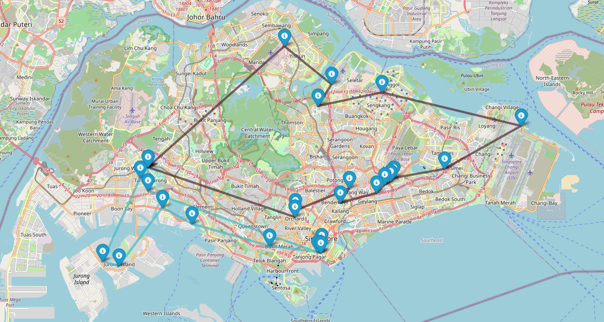

<a id="readme-top"></a>
# routejooz-api
This repo serves as the **backend** for the [IJooz Route Optimisation Platform](https://github.com/hrishikeshsathyian/route-jooz-frontend) Project


> Note: This project is part of a **polyrepo** system. While the frontend is in a separate repo, this backend can still be run standalone for solving and viewing optimized routes.

## Table of Contents 
<ol>
    <li>
        <a href="#about-the-project">About The Project</a>
        <ul>
        <li><a href="#how-it-works">How It Works</a></li>
        <li><a href="#built-with">Built With</a></li>
        </ul>
    </li>
    <li>
        <a href="#getting-started">Getting Started</a>
        <ul>
        <li><a href="#prerequisites">Prerequisites</a></li>
        <li><a href="#installation">Installation</a></li>
        <li><a href="#usage">Usage</a></li>
        </ul>
    </li>
    <li><a href="#contact">Contact and Links</a></li>
    <li><a href="#acknowledgments">Acknowledgments</a></li>
</ol>


## About the Project

Given a list of postal codes, this backend project generates optimized refill routes for iJooz drivers, accounting for constraints such as max available drivers and maximum single driver time. 

Minimizes cost incurred by iJooz by reducing **total driving time** (hence petrol cost) and minimizing **total drivers used**.
 

### How It Works
The backend process is be broken down into 3 main parts: <br>**Preprocessing, Cost Matrix Generation, Route Optimization**
1. *Preprocessing* – Geocode vending machine postal codes into lat/lng coordinates (depot first).
2. *Cost Matrix Generation* – Use Haversine distances and selectively enhance K-nearest neighbors with Google Distance Matrix API to reduce cost.
3. *Route Optimization* – Solve using Google OR-Tools VRP with constraints like max driving time and fairness.


### Built With
[](Fast-url)
[](Google-Cloud)
[](Python)

<p align="right">(<a href="#readme-top">back to top</a>)</p>

## Getting Started
To get a local backend up and running, follow these simple steps.

### Prerequisites 

1. Get a Google Cloud API Key at [Google Cloud Console](https://console.cloud.google.com/)

2. Activate Distance Matrix API for that key via the API Library

3. Set Up a Supabase Project at [Supabase](https://supabase.com/) and obtain the SUPABASE_URL and SUPABASE_KEY for that project
<p align="right">(<a href="#readme-top">back to top</a>)</p>

###  Running & Installation 

1. Clone the repo
   ```sh
   git clone https://github.com/hrishikeshsathyian/routejooz-api.git
   ```
3. Create a Virtual Environment and install requirements
   ```python
    python3 -m venv routejooz
    source routejooz/bin/activate
    pip install -r requirements.txt
   ```
4. Copy .env.example into a file named .env and replace the keys with your own keys from the previous section
   
5. Start the server with 
    ```python
    uvicorn main:app --reload
   ```

   
### Usage

1. Test the endpoints as defined in main.py. For example, to test the results with 3 drivers, use Postman or Browser to test against 
    ```bash
    http://127.0.0.1:8000/solve/3 
    ```
2. Open the generated routes_map.html file to view a quick draw up of the optimal routes
    ```python
    open routes_map.html
   ```
3. An example of the map would look like 
<p align="center">
  
</p>

<p align="right">(<a href="#readme-top">back to top</a>)</p>

## Contact and Links

Hrishikesh Sathyian - [LinkedIn](https://www.linkedin.com/in/hrishikesh-sathyian/) - [Email](hrishikeshsathyian2002@gmail.com)

Frontend Repository Link: [https://github.com/hrishikeshsathyian/route-jooz-frontend](https://github.com/hrishikeshsathyian/route-jooz-frontend)

<p align="right">(<a href="#readme-top">back to top</a>)</p>


## Acknowledgements

This project was inspired from this [blog](https://medium.com/@brockarnold/solving-a-capacitated-vehicle-routing-problem-with-google-or-tools-and-mapbox-a2eeb6b47bca) written by Brock Arnold about solving a capcitated vehicle routing problems

<p align="right">(<a href="#readme-top">back to top</a>)</p>